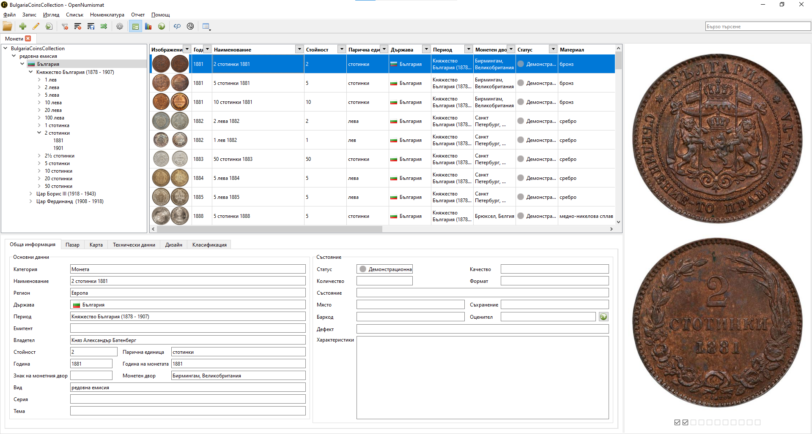

# Каталог Български Царски и Княжески Монети (1881-1943)

* [Какво представлява](#chapter1)
* [Какво съдържа](#chapter2)
* [Как да го използваме](#chapter3)
* [Авторство и права за ползване](#chapter4)
* [Благодарности и използвани източници](#chapter5)

##  Какво представлява

База с данни за [OpenNumismat](https://opennumismat.github.io/bg/) съдържащ всички циркулационни Kняжески и Царски монети в периода 1881-1943 година.

**OpenNumismat** е безплатен софтуер с отворен код за колекционери.

OpenNumismat е удобно и надеждно приложение, предназначено за колекционери на монети, нумизмати или аматьори, които искат да създадат колекция за нумизматика.

С OpenNumismat, ще можете да организирате и управлявате колекцията си от монети: да създадете разширен каталог на вашите монети, списъци с желани и продадени, преглед на статистически данни за вашата колекция.

Целта му е да бъде момощник на любителите нумизмати и колекционери с интерес към българските монети в този период.

Свалете каталога от [тук](https://github.com/chavdarb/BulgarianCoinsCatalog/releases/download/1.0/BulgariaCoinsCollection.db).

##  Какво съдържа

Каталога съдържа информация за Български монети в периода на Княжеска и Царска България (1881-1943).

Може да намерите следните данни:

* година и номинал
* монетен двор
* материал
* технически данни (форма, диаметър, тегло, ориентация)
* гурт
* тираж
* изображения лице и гръб
* включва следните вариации
	* 50 стотинки 1910 отворено **'Н'**
	* 1 и 2 лева 1923 с черта и без черта
	* 20 лева 1940 с голямо **'А'**
	* 50 стотинки и 1 лев 1916 малък и голям зрънчест кръг	

##  Как да го използваме

За да използвате каталога имате нужда от https://opennumismat.github.io/bg/

1. Свалете и инсталирайте OpenNumismat от [тук](https://opennumismat.github.io/bg/open-numismat/#download).
2. Свалете каталога от [тук](https://github.com/chavdarb/BulgarianCoinsCatalog/releases/download/1.0/BulgariaCoinsCollection.db)

	
	
	В момента файла се казва **BulgariaCoinsCollection.db**. 
	Запазете каталога на подходящо място на своя компютър. Там ще бъдат съхранени и монетите от вашата колекция които добавяте.	

3. Отворете каталога в OpenNumismat

	
	
4. Еднократно попълнете номенклатурата от каталога в програмата

	
	
5. Всички монети са добавени като демонстрационни. 

	

	За да добавите свои своята колекция използвайте **клониране** на желаната монета.
	Може да сложите свои снимки, качество и други детайли и променете статуса и по подходящ начин.
	
	
	
6. Повече информация може да намерите в [документацията](https://opennumismat.github.io/bg/open-numismat/manual.html) на OpenNumismat

##   Авторство и права за ползване

   Каталога е разработен с цел лична употреба и се разпространява без никакви гаранции и ангажименти.
   Kоментари забележки и предложения може да отправите на **chavdarb@yahoo.com**.
   
   
   Copyright 2023 Chavdar Baykov

   Licensed under the Apache License, Version 2.0 (the "License");
   you may not use this file except in compliance with the License.
   You may obtain a copy of the License at

       http://www.apache.org/licenses/LICENSE-2.0

   Unless required by applicable law or agreed to in writing, software
   distributed under the License is distributed on an "AS IS" BASIS,
   WITHOUT WARRANTIES OR CONDITIONS OF ANY KIND, either express or implied.
   See the License for the specific language governing permissions and
   limitations under the License.      

##   Благодарности и използвани източници

* [Каталози на български банкноти и монети БНБ](https://www.bnb.bg/ResearchAndPublications/PubNonPeriodical/PubNPCatalogues/index.htm)
* Снимки предоставени с любезното съдействие на [numizmatibg.com](https://numizmatibg.com/)

